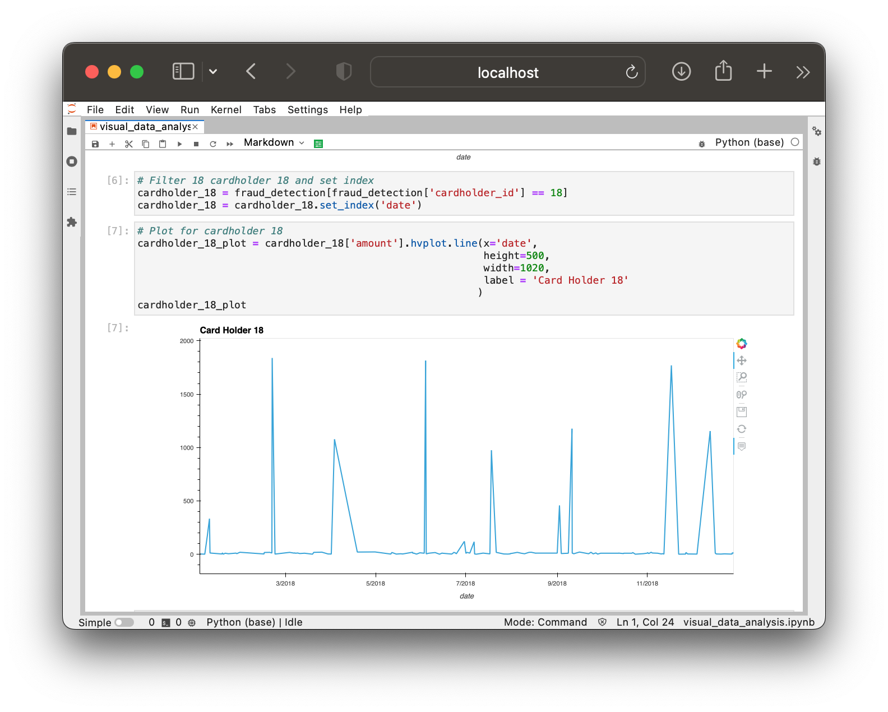
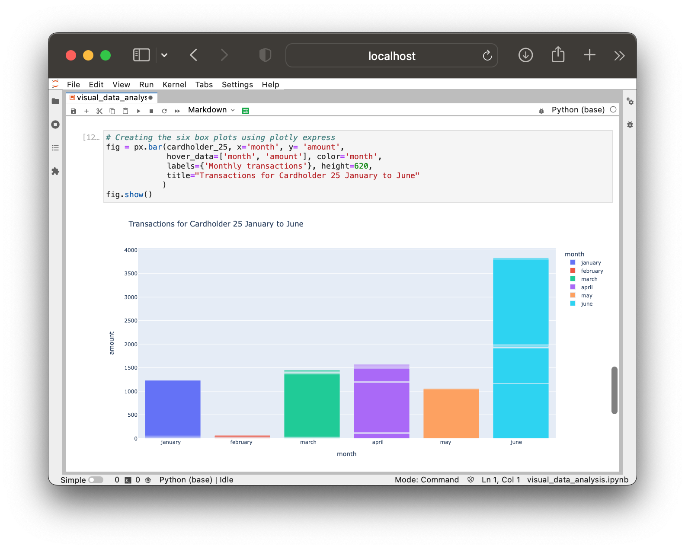

# Suspicious Transactions


## Table of Contents
1. [Data Modeling](#data-modeling)
2. [Part 1: SQL](#part-1-sql)
3. [Part 2: Visual Analysis](#part-2-visual-analysis)
4. [Results](#results)

## Data Modeling

- [x] Create an entity relationship diagram (ERD) by inspecting the provided CSV files.

  

## Part 1: SQL

Some fraudsters hack a credit card by making several small transactions (generally less than $2.00), which are typically ignored by cardholders.

  - [x] How can you isolate (or group) the transactions of each cardholder? 

    ```sql
    -- Part1 : Grouping transactions of each card returning card numbers only
    SELECT card
    FROM transaction 
    GROUP BY card;

    -- Part1 : Grouping by card and joining cardholder name, cardholder id and their total transaction amounts
    SELECT card_holder.name, credit_card.cardholder_id, transaction.card, sum(amount) as total_spent
    FROM transaction 
    LEFT JOIN credit_card
    on transaction.card = credit_card.card
    LEFT JOIN card_holder
    on credit_card.cardholder_id = card_holder.id
    GROUP BY transaction.card, credit_card.cardholder_id, card_holder.name;
    ```
    - **Output:** [Group cardholder transactions](./output/grouping_cardholders.csv)

  - [x] Count the transactions that are less than $2.00 per cardholder. 

    ```sql
    -- Part1 : Count transactions less than $2 per cardholder
    SELECT card, COUNT(amount) as tx_less_than_2
    FROM transaction
    WHERE amount < 2
    GROUP BY card
    ORDER BY tx_less_than_2 DESC;
    ```
    - **Output:** [Small transactions count of less than $2](./output/tx_less_than_2.csv)

    ```yaml
    ---
    Question: |
      Is there any evidence to suggest that a credit card has been hacked? Explain your rationale.
      
    Answer: | 
      Yes, Possily. With the assumption of the small transaction hack, cards with the highest count of transations less than $2 have possibly been hacked.
    ```
    - [x] Take your investigation a step futher by considering the time period in which potentially fraudulent transactions are made. 

      ```sql
      -- Part1 : Count transactions less than $2 per cardholder group by date
        SELECT date, card, COUNT(amount) as tx_less_than_2
        FROM transaction
        WHERE amount < 2
        GROUP BY card, date
        ORDER BY tx_less_than_2 DESC;
       ```
      - **Output:** [Small transactions grouped by date](./output/tx_less_than_2_groupby_date.csv)

  - [x] What are the top 100 highest transactions made between 7:00 am and 9:00 am? 

    ```sql
    -- Part1 : Top 100 highest transactions made between 7:00am and 9:00am
    SELECT date, amount
    FROM transaction
    WHERE EXTRACT(HOUR FROM date) BETWEEN '07' AND '08'
    ORDER BY amount DESC
    FETCH FIRST 100 ROWS ONLY;
    ```
      - **Output:** [Top 100 transactions between 7:00am and 9:00am](./output/top_100_highest_tx_7am_to_9am.csv)
  ```yaml
  ---
  Question: | 
    Do you see any anomalous transactions that could be fraudulent
  Answer: | 
    No.
  ---
  Question: |
    Is there a higher number of fraudulent transactions made during this time frame versus the rest of the day?
  Answer: | 
      No, the data does not show any correlation to higher number of fradulent transactions.
  ----
  # If you answered yes to the previous question, explain why you think there might be fraudulent transactions during this time frame.
  ```

  - [x] What are the top 5 merchants prone to being hacked using small transactions? 

    ```sql
    -- Part1 : Top 5 merchants prone to being hacked using small transactions
    SELECT id_merchant, count(amount) as number_of_small_tx
    FROM transaction
    WHERE amount < 2
    GROUP BY id_merchant
    ORDER BY count(amount) DESC
    LIMIT 5;
    ```
      - **Output:** [Top 5 merchants prone to small transaction hack](./output/top_5_merchants_small_tx_hack.csv)

## Part 2: Visual Analysis

The two most important customers of the firm may have been hacked. Verify if there are any fraudulent transactions in their history. For privacy reasons, you only know that their cardholder IDs are 2 and 18.

  - [x] Using hvPlot, create a line plot representing the time series of transactions over the course of the year for each cardholder separately. 

    - Cardholder 2
        

    - Cardholder 18
       

  - [x] Next, to better compare their patterns, create a single line plot that contains both card holders' trend data.  

    

  ```yaml
   # Question 
  |
    What difference do you observe between the consumption patterns? Does the difference suggest a fraudulent transaction? Explain your rationale.
   
  Answer: | 
    Cardholder 2 has a small dollar amount spending habit while Cardholder 18 has a larger dollar amount spending habit. The difference in spending amounts can indicate fradulent activity on the card if the spending amount is significantly different from their normal spending. For Example, Cardholder 18 has transactions of less than $2, different from their usual larger dollar amount spendidng habit. This could suggest fradulent activity, however this data alone is inconclusive.
  ```
  - [x] Using Plotly Express, create a box plot, representing the expenditure data from January 2018 to June 2018 for cardholder ID 25.

    

  ```yaml
 # First Question
  Question: | 
  Are there any outliers for cardholder ID 25? How many outliers are there per month?
  Answer: |
    Yes. There are multiple putliers at least once a month

  # Second Question
  Question: | 
  Do you notice any anomalies? Describe your observations and conclusions.
  Answer: | 
    Yes, there are anomalies. Cardholder 25 has extremely large dollar amount transactions and extremely low dollar amount transactions.
  ```
## Results
- [ERD Data Model](./images/database_ERD.png)
- [Schema.sql](./schema.sql)
- [Query.sql](./query.sql)
- [Visualization Analysis](./visual_data_analysis.ipynb) 


<!--
## Challenge

* Use the [challenge starter notebook](Starter_Files/challenge.ipynb) to code two Python functions:

* One that uses standard deviation to identify anomalies for any cardholder.

* Another that uses interquartile range to identify anomalies for any cardholder.

* For help with outliers detection, read the following articles:

  * [How to Calculate Outliers](https://www.wikihow.com/Calculate-Outliers)

  * [Removing Outliers Using Standard Deviation in Python](https://www.kdnuggets.com/2017/02/removing-outliers-standard-deviation-python.html)

  * [How to Use Statistics to Identify Outliers in Data](https://machinelearningmastery.com/how-to-use-statistics-to-identify-outliers-in-data/)
-->
